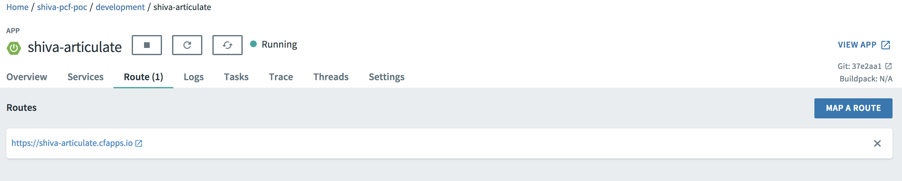
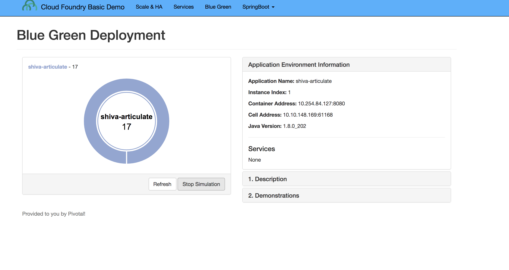
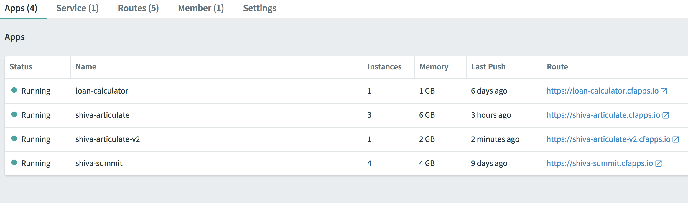
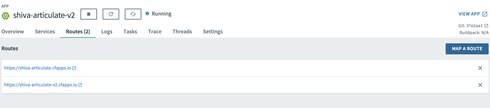
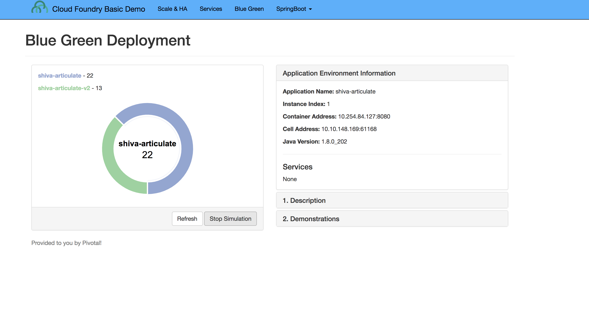
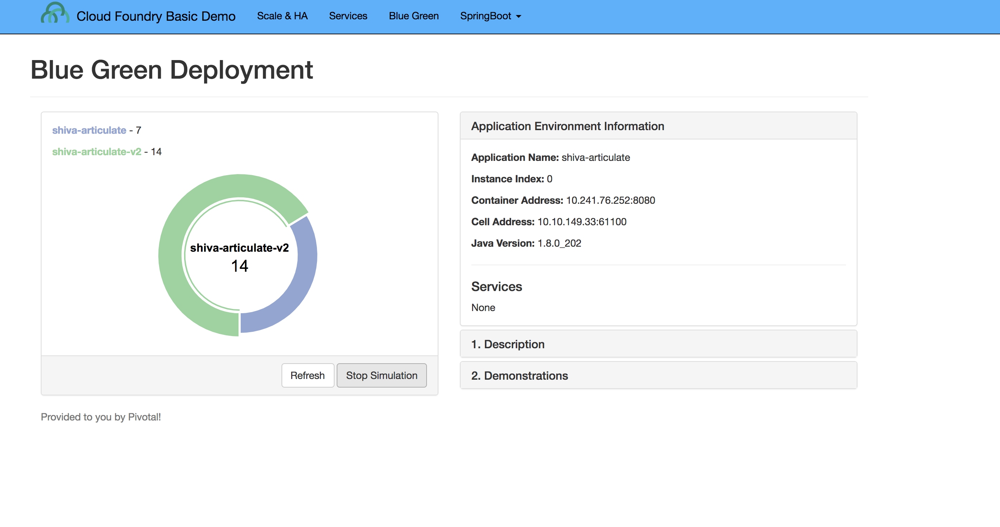
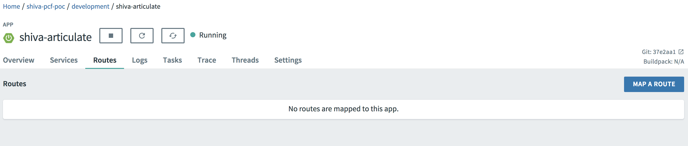
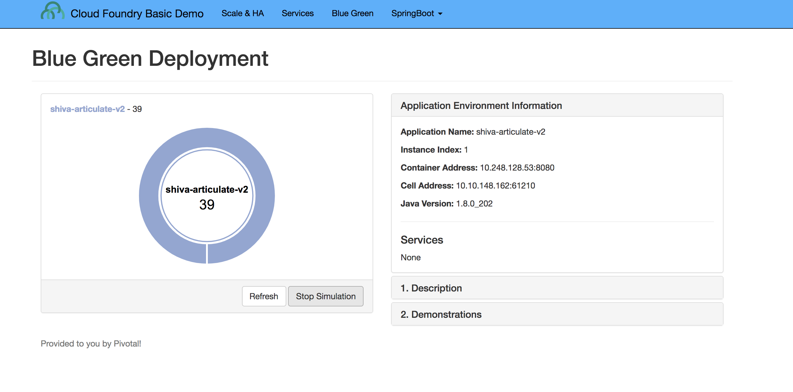

= Lab 4 - Zero Downtime Deployment

[abstract]
--
Pivotal Cloudfoundry makes the work of performing operations actions, such as scaling, doing a zero-downtime deploy, and managing application health very easy.
In the next two labs we'll explore Pivotal Cloud Foundry operations.
--

== Zero Downtime Deployment

For this lab, we will simulate a zero downtime deployment by using Routes and deploying the same articulate application and diverting traffic from one app to another.

. When you navigate to your app in App Manager and click on 'Route' link, you will see that your app is bound to one Route which is in the appname.domainname format.
+

. When you click on your app's route, it opens the app in a new window. Click on the Blue-Green menu option at the top and 'start' the simulation. This will send requests to the route and show which app is servicing the request for that route. As can be seen below, all requests are serviced by the articulate instance of your app.
+

. In the command line window navigate to the /deployables/articulate directory, we will push the same articulate app but with a different name (add a -v2 at the end of the name). It will be assigned a default route in the format appname.domainname.
+
----
> cf push paragdoshi-articulate-v2
----
+

. When you navigate to the App Manager, you will see two articulate apps but with different routes. In a blue-green deployment, v2 is the newer version of your app that you want to release to the world. 
+

. When you click on the v2 articulate app link, it will take you to the articulate app instance that is servicing that particular route. In App Manager, add an additional route to v2 version of the app. This additional route will be the same route as serviced by the first articulate app. In essence, we are trying to divert some amount of traffic to the newer version of the apps and the remaining traffic to the older version of the app. Click on the 'Route' link for the v2 app and click on 'Map a Route' button. In the text field, enter the host (sub-domain) of your previous application - in my case, it is paragdoshi-articulate. The domain name is available as a dropdown value on the screen. After adding another route, you will see something simiar to below:

+

. Now, navigate back to your earlier articulate app, click on the Blue-Green link and if the simulation is still going on - click on Reset button and then hit 'Start'. You will notice that now the traffic is split between the two apps. The original app gets 2/3 of the traffic while the v2 app gets 1/3. Why? Because you have two instances running of the previous articulate app and one instance of v2 of the app.

+

. Navigate to App Manager, scale up an additional instance of v2 articulate app and scale down one instance of the previous articulate app. Go back to the articulate app, hit 'Reset' and then hit 'Start'. Now you should see 2/3 of the traffic diverted to v2 of the app and 1/3 of the traffic diverted to previous version of app.
+

. Finally, navigate to App Manager and go to the previous articulate app, click on Routes and click on the red 'x' to remove the route. After removing the route, your previous app is now inaccessible to any user traffic.

+

. Go back to the articulate app and hit 'Reset' and then hit 'Start'. You will see that all traffic is now serviced by v2 of the app. You have successfully completed a zero downtime deployment!
+

*Congratulations!* You performed a blue-green deployment.

=== Questions
* How would a rollback situation be handled using a blue-green deployment?
* What other design implications does running at least two versions at the same time have on your applications?
* Do you do blue-green deployments today? How is this different?

== Clean Up

. Delete the v2 articulate app - Navigate to v2 articulate app and click on 'Settings'. Scroll down to the end of the page and there will be a 'Delete App' button. Click on it, re-confirm the delete and this will delete v2 articulate app.

. Re-add the orgiinal route back to your previous articulate app so that it is again accessible with that route. In my case, the route name was shiva-articulate. Click on the route and make sure your app is accessible again.
